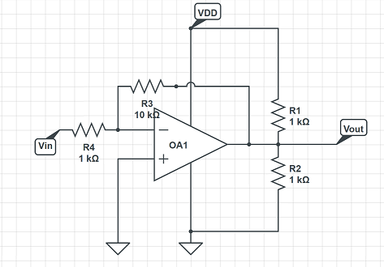
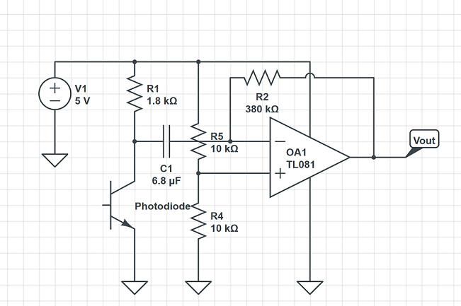

# Lab 2
[Home](./index.md)

Acoustic Subteam: Ben, Michael

Optical Subteam: Felicia, Ria, Ian

Materials:  
  * Arduino Uno
  * Electret Microphone
  * IR Transistor (OP598)
  * IR 'Hat'
  * IR Decoy
  * Various other components, as needed
  
The purpose of this lab is to implement new hardware that allows our robot to ‘see’ and interact with its surroundings to a greater extent.  These hardware additions include a microphone and an IR phototransistor and IR emitter ‘hat,’ which allows our robot to interpret audible and IR signal information and react accordingly.  When fully applied, our robot will have two additional functionalities that will assist us during our final project: the ability to start operation upon perceiving an audio signal at 660 Hz, and the ability to detect other robots outfitted with a similar IR emitter hat.

## Method - Acoustic:

We began this portion of the lab by retrieving the necessary materials and proceeding to power our electret microphone as instructed, detailed in the diagram below.

.png)  

This subteam’s goal was to get our robot to identify an audio signal at 660 Hz.  However, upon connecting the output of our circuit to an oscilloscope, we soon discovered that playing loud audio signals into this microphone results in an output that is too low in voltage to be perceived.  As such, we processed the output of this circuit through a simple inverting amplifier (topology shown below), realized using an LM358 op-amp. 

The output of this amplifier is in the proper voltage range to be detected by our Arduino:

### Vout = VR + ((RF/R1)\*(V2-V1))

Next, we focused on detecting the frequency of the signal reproduced by our microphone circuit. In order to do this, we used [Open Music Labs’s Arduino FFT library](http://wiki.openmusiclabs.com/wiki/ArduinoFFT) to compute a Fast Fourier Transform (FFT) on this signal. A Fourier Transform is an algorithm that takes a time-dependent signal and breaks it down into its corresponding frequency components.  Using slightly-modified code from [Team Alpha’s write-up](https://cei-lab.github.io/ECE3400-2017-teamAlpha/lab2.html) of this lab, we were able to repeatedly compute a 256 point FFT on the microphone circuit’s output by continuously calling analogRead() on one of the Arduino’s analog inputs:

~~~c
for (int i = 0 ; i < 512 ; i += 2) {
    fft_input[i] = analogRead(A0); 
    fft_input[i+1] = 0;
}
fft_window();
fft_reorder();
fft_run();
fft_mag_log();
sei();
~~~

<iframe width="560" height="315" src="https://www.youtube.com/embed/tw2DTEFJ99Q" frameborder="0" allow="autoplay; encrypted-media" allowfullscreen></iframe>

By dumping the output of these FFTs to serial, we were able to confirm that 660 Hz signals fall in the 3rd FFT bin. As such, if our system perceives a signal in this bin above a certain threshold over 10 consecutive computations of the FFT, it will decide that it has recognized a 660 Hz signal. This helped detect a constant tone within an ambient noise signal.  In practice, our robot will use this tone as a starting signal to begin normal operations, so we do not need to worry about subsequent detection of a 660 Hz signal.

In this video, we confirm the operation of our microphone under the noise of a crowd, an attempt to mimic the final competition conditions:

<iframe width="560" height="315" src="https://www.youtube.com/embed/bWo25RgRp0k" frameborder="0" allow="autoplay; encrypted-media" allowfullscreen></iframe>

## Method - Optic:

Our robot will eventually be used to traverse a maze while other robots attempt to do the same, so our robot needs to be able to detect these other robots in order to prevent collisions.  In order to accomplish this, we used a phototransistor to output an IR-dependent voltage.  
We measured the output of the phototransistor circuit when we turned our IR hat on. Since a visible peak to peak voltage was only observed when the IR hat was extremely close (about 3cm), we decided to include an amplifier in the circuit.

An inverting amplifier configuration was used. We first tested our amplifier circuit with a sinusoidal signal and a 2.5V DC offset to prevent clipping.

A video of our working amplifier is shown below:
<iframe width="560" height="315" src="https://www.youtube.com/embed/db3fsimdbAE" frameborder="0" allow="autoplay; encrypted-media" allowfullscreen></iframe>

We then connected the IR dependent voltage signal to the input of the op-amp. The DC offset was removed, and a capacitor was put in series with the voltage signal to eliminate the DC offset of the signal (about 4.6V directly from the IR sensor output) and prevent clipping. 

When we tested again with the IR hat, for a sensor on one white line of the given grid, it could detect the IR hat on the line next to it.
The next step was to get the Arduino to detect frequencies from our optical circuit output. For this we used the Open Music Library. 

Our final system with the merged optical and audio circuits is shown below:
<iframe width="560" height="315" src="https://www.youtube.com/embed/t8LybhyNJdY" frameborder="0" allow="autoplay; encrypted-media" allowfullscreen></iframe>
