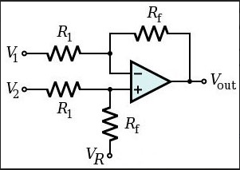

# Lab 2
[Home](./index.md)

Acoustic Subteam: 

Optical Subteam: 

Materials:  
  * Arduino Uno
  * Electret Microphone
  * IR Transistor (OP598)
  * IR 'Hat'
  * IR Decoy
  * Various other components, as needed
  
The purpose of this lab is to implement new hardware that allows our robot to ‘see’ and interact with its surroundings to a greater extent.  These hardware additions include a microphone and an IR phototransistor and IR emitter ‘hat,’ which allows our robot to interpret audible and IR signal information and react accordingly.  When fully applied, our robot will have two additional functionalities that will assist us during our final project: the ability to start operation upon perceiving an audio signal at 660 Hz, and the ability to detect other robots outfitted with a similar IR emitter hat.

## Method - Acoustic:

We began this portion of the lab by retrieving the necessary materials and proceeding to power our electret microphone as instructed, detailed in the diagram below.

.png)  

This subteam’s goal was to get our robot to identify an audio signal at 660 Hz.  However, upon connecting the output of our circuit to an oscilloscope, we soon discovered that playing loud audio signals into this microphone results in an output that is too low in voltage to be perceived.  As such, we processed the output of this circuit through a simple inverting amplifier (topology shown below), realized using an LM358 op-amp. 

The output of this amplifier is in the proper voltage range to be detected by our Arduino:

### Vout = VR + ((RF/R1)\*(V2-V1))

Next, we focused on detecting the frequency of the signal reproduced by our microphone circuit. In order to do this, we used [Open Music Labs’s Arduino FFT library](http://wiki.openmusiclabs.com/wiki/ArduinoFFT) to compute an FFT on this signal. Using slightly-modified code from [Team Alpha’s write-up](https://cei-lab.github.io/ECE3400-2017-teamAlpha/lab2.html) of this lab, we were able to repeatedly compute a 256 point FFT on the microphone circuit’s output by continuously calling analogRead() on one of the Arduino’s analog inputs:

~~~c
for (int i = 0 ; i < 512 ; i += 2) {
    fft_input[i] = analogRead(A0); 
    fft_input[i+1] = 0;
}
fft_window();
fft_reorder();
fft_run();
fft_mag_log();
sei();
~~~
